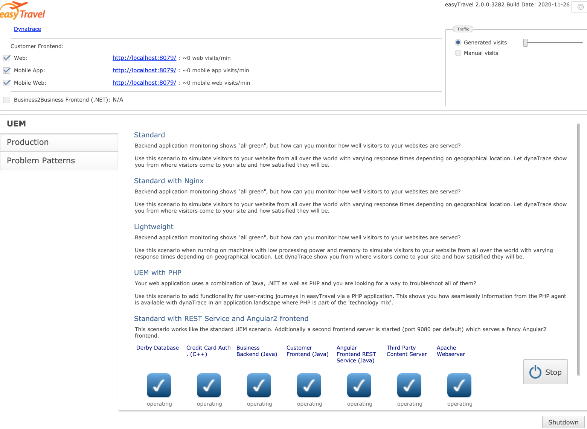
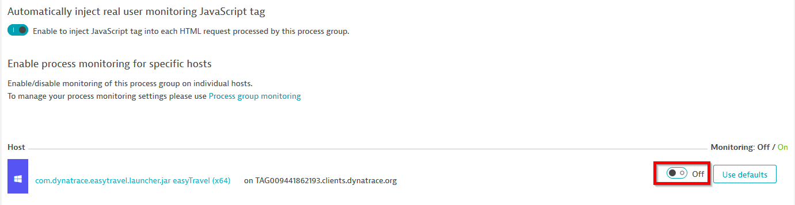

summary: Deploy Easytravel @ 127.0.0.1
id: deploy-easytravel-at-localhost
categories: easytravel, DEM, localhost
tags: DEM, localhost, easytravel
status: Published
authors: sergio.hinojosa

# Deploying Easytravel @ 127.0.0.1

## Introduction 
Duration: 3

for learning, and playing around there is nothing better than having a separate VM that you can break. This can be either an instance in a cloud provider or a virtual machine @ localhost. On your working station you can use a docker container with an ubuntu image or https://multipass.run/. Multipass is a great way to instantiate Ubuntu VMs and runs on Linux, Mac and Windows. it's made by the Ubuntu team highly optimized. 

## Multipass Comands
Duration: 5

### Download & Install
Download multipass and install it depending on your OS https://multipass.run/

### Show the help
```bash
multipass -h
```

###  Start a VM with x size
```bash
multipass launch --name <vm-name> --mem 4G --disk 10G --cpus 2
```

###  Start the VM	
```bash
multipass start <vm-name>
```

### Stop the VM	
```bash
multipass stop <vm-name>
```
### List VMS
```bash
multipass list
```

### Shell into the VM
> you can also shell into the vm with the ip but you need to set a password for the user ubuntu and enable password on the SSH service
```bash
multipass shell <vm-name> 
```

## Install  Easytravel
Duration: 10


### Create VM 
```bash
multipass launch --name easytravel --mem 4G --disk 10G --cpus 2
```

### Start VM 
```bash
multipass start easytravel
```

### Shell into VM 
```bash
multipass shell easytravel
```

### Download install script
>Download help script to install Easytravel, Nginx, Docker and other utils	
```bash
wget https://raw.githubusercontent.com/sergiohinojosa/Dynatrace-REST-Tenant-Automation/master/aws/ubuntu-setup-easytravel.sh
```

### Make the log visible also on the console
```bash
sed -i 's/pipe_log=true/pipe_log=false/g' ubuntu-setup-easytravel.sh
```

### (Optional) Let it install the OneAgent
Positive
: If you want that the script installs the OneAgent for you before installing easyTRavel and the docker containers, just add the variables at the top

```bash
## Set TENANT and API TOKEN
# ---- Define Dynatrace Environment ----
# Sample: https://{your-domain}/e/{your-environment-id} for managed or https://{your-environment-id}.live.dynatrace.com for SaaS
TENANT=
PAASTOKEN=
APITOKEN=
```

### Execute script
> run the command as root for installing also utils as docker, in the VM you have a docker server where you can spin containers also easily. The script will install easytravel start it and it wll also install the BankJob (a java app for learning how the basline of Davis works) and an NGINX reverse proxy that routes the traffic of EasyTravel Angular to port 80.
```bash
sudo su;
sh ubuntu-setup-easytravel.sh;
```

### Verify the log of Easytravel
> This is optional just for you to know where the output of Easytravel is being piped out. Each Easytravel component writes is logs. You can check them on the Admin console of Easytravel 
```bash
less +F /tmp/weblauncher.log
```

### Check running containers
> Docker is installed on the system. There are two running containers, one is a java app called "BankJob" another is nginx working as a reverse proxy for multiple endpoints of Easytravel
```bash
docker ps
```

### stop all containers 
```bash
docker stop reverseproxy bankjob
```

### start all containers 
```bash
docker start reverseproxy bankjob
```

## Loadgenerator for easyTravel
Duration: 5

The load generation for EasyTravel is defined in the `easyTravelConfig.properties` file which is setted up during the installation. The properties starting with `config.baseLoad..`  are the ones defining [these values (changed at installation)](https://github.com/sergiohinojosa/Dynatrace-REST-Tenant-Automation/blob/master/aws/ubuntu-setup-easytravel.sh#L227). Also you can manage set this values manually by accessing the [http://easytravel/admin](http://easytravel/admin) interface and moving the slider manually.

🟡 UserActions for easyTravel Classic and Angular use different Load generators, the one for classic (older and embedded in the web launcher process) is  detected by Dynatrace that are not real users and the Actions are displayed as requests (can be confirmed doing a backtrace from the Database). The load generator for Angular spins every time a chromium process and does a session based on a browser as you would. For fixing the UserActions for Classic just remove deep monitoring for the web launcher process.


## Access endpoints

### http://easytravel


### http://easytravel/classic
Negative
: Use port 8079 if you do a session booking or a loadtest. Classic does not like to be rewritten over a proxy. If you know how to solve this, please submit a PR.


### http://easytravel/admin



### http://easytravel/amp


## Troublehooting 

Positive
: Here are some tips on how to stop and start all easytravel processes. 


### Kill all processes
```bash
killall java
```

### Start easyTravel as UBUNTU (not root)	
> If you happen to install easytravel as root, you might want to change recursively all the rights of the easytravel installation folder so all processes can run properly
```bash
sh /home/ubuntu/easytravel-2.0.0-x64/weblauncher/weblauncher.sh > /tmp/weblauncher.log 2>&1 &
```

### Fix easyTravel rights
```bash
chmod 755 -R /home/ubuntu/easytravel-2.0.0-x64/
```

### Fix easyTravel ownership
```bash
chown ubuntu:ubuntu -R /home/ubuntu/easytravel-2.0.0-x64/
```

### Check if there are running easytravel leftovers (processes)
```bash
ps -aux | grep easy
```

### Restart all with a one-liner (must be root)
```bash
sudo su;
killall java; docker start reverseproxy bankjob; USER=ubuntu; su -c "sh /home/$USER/easytravel-2.0.0-x64/weblauncher/weblauncher.sh > /tmp/weblauncher.log 2>&1 &" $USER
```


## Tips & Links

### Disable monitoring of launcher 

Negative
: You should disable monitoring of launcher (com.dynatrace.easytravel.launcher.jar easyTravel (x64)) processes. 

For RUM to work properly (for the classic app e.g. Loadgenerator) you need to disable deep monitoring for the weblauncher process.

On the entity select edit...


Then disable monitoring for that process group instance...


### easyTravel documentation
[https://confluence.dynatrace.com/community/display/DL/easyTravel](https://confluence.dynatrace.com/community/display/DL/easyTravel)


